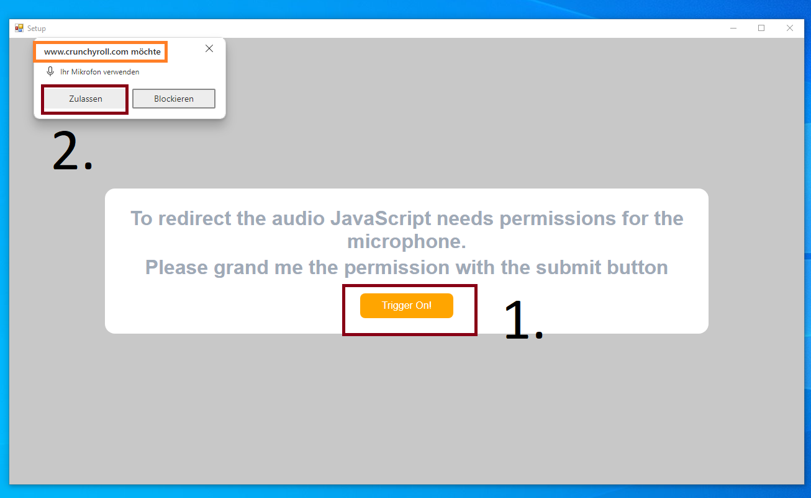

  ## This is only a [proof of concept](https://en.wikipedia.org/wiki/Proof_of_concept) for a semi automatic recording of the Cruchyroll content.
  ### My understanding of this [German case](https://www.aufrecht.de/?id=5231) is that there is no copy protection on the playback and recording is basicly the same as recording the Monitor/TV (via a Camera).
  ### Please check your nativ langauge Crunchyroll ToS (if acceptet because of the acccount registration) this may breach the contrat. 
### Software Requirements: 
 - Windows 10 or Windows 11
 - [WebView2 Runtime (which you get from this Microsoft page)](https://developer.microsoft.com/en-us/microsoft-edge/webview2/#download-section)
 - Microsoft Visual C++ 2017 Redistributable
 - [VB-CABLE](https://vb-audio.com/Cable/)
 - [OBS (tested with 30.1.0)](https://obsproject.com/)
 - [ffmpeg (to be placed inside /lib/ folder)](https://ffmpeg.org/download.html#build-windows)

## Some required settings:
### Open the setup dialog

### Press the 'Trigger On' button to inject a Script to allow further [Scripts](https://github.com/hama3254/Crunchyroll-Recorder/blob/5620d43588d26c64928855e8f5a196d474a688ef/BrowserWindow/BrowserWindow.vb#L303) to access ['video.setSinkId'](https://developer.mozilla.org/en-US/docs/Web/API/HTMLMediaElement/setSinkId)

### You can now (optinal, untested due to ads) login.

### To now Record the video you need to Url and select a audio device (VB-CABLE is recommend)

